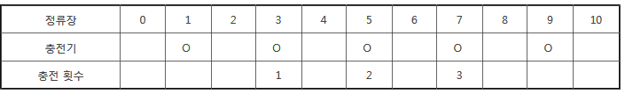

## ※ SW Expert 아카데미의 문제를 무단 복제하는 것을 금지합니다.

A도시는 전기버스를 운행하려고 한다. 전기버스는 한번 충전으로 이동할 수 있는 정류장 수가 정해져 있어서, 중간에 충전기가 설치된 정류장을 만들기로 했다.
버스는 0번에서 출발해 종점인 N번 정류장까지 이동하고, 한번 충전으로 최대한 이동할 수 있는 정류장 수 K가 정해져 있다.
충전기가 설치된 M개의 정류장 번호가 주어질 때, 최소한 몇 번의 충전을 해야 종점에 도착할 수 있는지 출력하는 프로그램을 만드시오.
만약 충전기 설치가 잘못되어 종점에 도착할 수 없는 경우는 0을 출력한다. 출발지에는 항상 충전기가 설치되어 있지만 충전횟수에는 포함하지 않는다.
 
[예시]

다음은 K = 3, N = 10, M = 5, 충전기가 설치된 정류장이 1, 3, 5, 7, 9인 경우의 예이다.



[입력]
첫 줄에 노선 수 T가 주어진다.  ( 1 ≤ T ≤ 50 )
각 노선별로 K, N, M이 주어지고, 다음줄에 M개의 정류장 번호가 주어진다. ( 1 ≤ K, N, M ≤ 100 )

[출력]
#과 노선번호, 빈칸에 이어 최소 충전횟수 또는 0을 출력한다.

```python
import sys
T = int(sys.stdin.readline())
for a in range(1,T+1):
    K, N, M = map(int, sys.stdin.readline().split()) #K: 한번에 최대 이동가능한 거리 N: 전체 정류장 개수 M: 설치된 개수
    M_num = list(map(int, sys.stdin.readline().split())) #충전기가 있는 정류장
    lis = list(range(0,N+1)) #전체 경로(정류장 수 만큼)
    for b in M_num:
        lis[b] = 1 #충전기가 있는 정류장에 1을 주어줌
    mid = 0
    cnt = 0 # 답
    while mid < N-K: #버스가 이동한 경로
        mid_sum = 0 # 한 스탭에서 시작구간과 충전이 된 구간의 거리를 저장.
        for c in range(mid+K,mid,-1): #이동한 거리
            if lis[c] == 1:
                mid = c
                cnt += 1
                mid_sum += 1
                break
        if mid_sum == 0:
            cnt = 0
            break
    print("#{} {}".format(a, cnt))
```